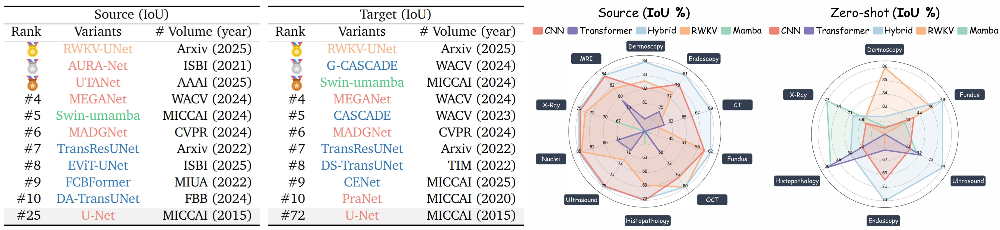

# U-Bench: A Comprehensive Understanding of U-Net through 100-Variant Benchmarking


<div align="center">
    <span class="author-block">
    <a href="https://scholar.google.com/citations?user=x1pODsMAAAAJ&hl=en" target="_blank">Fenghe Tang</a><sup>1,2</sup>,</span>
    <span class="author-block">
    <a target="_blank">Chengqi Dong</a>,</span>
    <span class="author-block">
    <a href="https://scholar.google.com/citations?user=r0-tZ8cAAAAJ&hl=en" target="_blank">Wenxin Ma</a><sup>1,2</sup>,</span>
    <span class="author-block">
    <a href="https://scholar.google.com/citations?user=TxjqAY0AAAAJ&hl=en" target="_blank">Zikang Xu</a><sup>3</sup>,</span>
    <br>
    <span class="author-block">
    <a href="https://scholar.google.com/citations?user=YkfSFekAAAAJ&hl=en" target="_blank">Heqin Zhu</a><sup>1,2</sup>,</span>
    <span class="author-block">
    <a href="https://scholar.google.com/citations?user=Wo8tMSMAAAAJ&hl=en" target="_blank">Zihang Jiang</a><sup>1,2</sup>,</span>
    <span class="author-block">
    <a href="https://scholar.google.com/citations?user=rYP1nFEAAAAJ&hl=en" target="_blank">Rongsheng Wang</a><sup>1,2</sup>,</span>
    <span class="author-block">
    <a href="https://scholar.google.com/citations?user=wi016FcAAAAJ&hl=en" target="_blank">Yuhao Wang</a><sup>1,2</sup>,</span>
    <span class="author-block">
    <a href="https://scholar.google.com/citations?user=tI39ThgAAAAJ&hl=en" target="_blank">Chenxu Wu</a><sup>1,2</sup>,</span>
    <span class="author-block">        
    <a href="https://scholar.google.com/citations?user=8eNm2GMAAAAJ&hl=en" target="_blank">Shaohua Kevin Zhou</a><sup>1,2</sup>
    </span>
</div>

<br>

<div align="center">
    <sup>1</sup>
    <a href='https://en.ustc.edu.cn/' target='_blank'>School of Biomedical Engineering, University of Science and Technology of China</a>&emsp;
    <br>
    <sup>2</sup> <a href='http://english.ict.cas.cn/' target='_blank'>Suzhou Institute for Advanced Research, University of Science and Technology of China</a>&emsp;
    <br>
    <sup>3</sup> <a target='_blank'>Anhui Province Key Laboratory of Biomedical Imaging and Intelligent Processing</a>
</div>
<br>

  [](https://fenghetan9.github.io/ubench)    [](https://arxiv.org/pdf/2510.07041)   [](https://github.com/FengheTan9/U-Bench)   [](https://huggingface.co/FengheTan9/U Bench)   <a href="#LICENSE--citation"></a>


### Catalog🚀🚀🚀

- [ ] U-Bench data 🤗🤗🤗
- [ ] U-Bench weights 🤗🤗🤗
- [x] U-Bench code 🤗🤗🤗
- [x] U-Bench paper 🤗🤗🤗

### Abstract

Over the past decade, U-Net has been the dominant architecture in medical image segmentation, leading to the development of thousands of U-shaped variants. Despite its widespread adoption, a comprehensive benchmark to systematically assess the performance and utility of these models is lacking, primarily due to insufficient statistical validation and limited attention to efficiency and generalization across diverse datasets. To address this gap, we present U-Bench, the first large-scale, statistically rigorous benchmark that evaluates 100 U-Net variants across 28 datasets and 10 imaging modalities. Our contributions are threefold: (1) Comprehensive Evaluation: U-Bench evaluates models along three key dimensions: statistical robustness, zero-shot generalization, and computational efficiency. We introduce a novel metric, U-Score, which jointly captures the performance-efficiency trade-off, offering a deployment-oriented perspective on model progress. (2) Systematic Analysis and Model Selection Guidance: We summarize key findings from the large-scale evaluation and systematically analyze the impact of dataset characteristics and architectural paradigms on model performance. Based on these insights, we propose a model advisor agent to guide researchers in selecting the most suitable models for specific datasets and tasks. (3) Public Availability: We provide all code, models, protocols, and weights, enabling the community to reproduce our results and extend the benchmark with future methods. In summary, U-Bench not only exposes gaps in previous evaluations but also establishes a foundation for fair, reproducible, and practically relevant benchmarking in the next decade of U-Net-based segmentation models.

### Anaylsis🧐

##### (1) Trends Analysis


##### (2) Significance Analysis


##### (3) Data Characteristics Analysis


### Quick Start 🤩🤩🤩

#### 1. Installation

```
git clone https://github.com/FengheTan9/U-Bench.git
cd U-Bench
conda create -n ubench python=3.9 -y  
conda activate ubench  
pip install -r requirements.txt  
```

#### 2. Datasets

Please put the dataset (e.g. BUSI) or your own dataset as the following architecture:

```
└── U-Bench
    ├── data
        ├── busi
            ├── images
            |   ├── benign (10).png
            │   ├── malignant (17).png
            │   ├── ...
            |
            └── masks
                ├── 0
                |   ├── benign (10).png
                |   ├── malignant (17).png
                |   ├── ...
        ├── your dataset
            ├── images
            |   ├── 0a7e06.png
            │   ├── ...
            |
            └── masks
                ├── 0
                |   ├── 0a7e06.png
                |   ├── ...
    ├── dataloader
    ├── models
    ├── utils
    ├── script
    ├── main.py
    └── main_multi3d.py
```

#### 3. Training & Validation

```python
# BUSI (in-domain)
python main.py --max_epochs 300 --gpu 0 --batch_size 8 --model U_Net --base_dir ./data/busi --dataset_name busi
# BUSBRA (In-domain)
python main.py --max_epochs 300 --gpu 0 --batch_size 8 --model U_Net --base_dir ./data/BUSBRA --dataset_name BUSBRA
# ISIC18 (In-domain)
python main.py --max_epochs 300 --gpu 0 --batch_size 8 --model U_Net --base_dir ./data/isic18 --dataset_name isic18
# SkinCancer (In-domain)
python main.py --max_epochs 300 --gpu 0 --batch_size 8 --model U_Net --base_dir ./data/uwaterlooskincancer --dataset_name uwaterlooskincancer
# Kvasir (In-domain)
python main.py --max_epochs 300 --gpu 0 --batch_size 8 --model U_Net --base_dir ./data/Kvasir-SEG --dataset_name Kvasir-SEG
# CHASE (In-domain)
python main.py --max_epochs 300 --gpu 0 --batch_size 8 --model U_Net --base_dir ./data/CHASEDB1 --dataset_name CHASEDB1
# DRIVE (In-domain)
python main.py --max_epochs 300 --gpu 0 --batch_size 8 --model U_Net --base_dir ./data/DRIVE --dataset_name DRIVE
# DSB2018 (In-domain)
python main.py --max_epochs 300 --gpu 0 --batch_size 8 --model U_Net --base_dir ./data/DSB2018 --dataset_name DSB2018
# GlaS (In-domain)
python main.py --max_epochs 300 --gpu 0 --batch_size 8 --model U_Net --base_dir ./data/Glas --dataset_name Glas
# Monusac (In-domain)
python main.py --max_epochs 300 --gpu 0 --batch_size 8 --model U_Net --base_dir ./data/monusac --dataset_name monusac
# Cell (In-domain)
python main.py --max_epochs 300 --gpu 0 --batch_size 8 --model U_Net --base_dir ./data/cellnuclei --dataset_name cellnuclei
# Convidquex (In-domain)
python main.py --max_epochs 300 --gpu 0 --batch_size 8 --model U_Net --base_dir ./data/covidquex --dataset_name covidquex
# Montgomery (In-domain)
python main.py --max_epochs 300 --gpu 0 --batch_size 8 --model U_Net --base_dir ./data/Montgomery --dataset_name Montgomery
# DCA (In-domain)
python main.py --max_epochs 300 --gpu 0 --batch_size 8 --model U_Net --base_dir ./data/dca1 --dataset_name dca1
# Cystoidfluid (In-domain)
python main.py --max_epochs 300 --gpu 0 --batch_size 8 --model U_Net --base_dir ./data/cystoidfluid --dataset_name cystoidfluid
# Synapse (3D-Slice)
python main_multi3d.py --max_epochs 300 --gpu 0 --batch_size 8 --model U_Net --base_dir ./data/synapse --dataset_name synapse --num_classes 9 --input_channel 3 --val_interval 100
# ACDC (3D-Slice)
python main_multi3d.py --max_epochs 300 --gpu 0 --batch_size 8 --model U_Net --base_dir ./data/ACDC--dataset_name ACDC --num_classes 4 --input_channel 3 --val_interval 100
```

#### 4. Zero-shot

```python
# BUSI -> BUS (zero-shot)
python inference_case.py --max_epochs 300 --gpu 0 --batch_size 8 --model U_Net --base_dir ./data/busi --dataset_name busi --zero_shot_base_dir ./data/bus --zero_shot_dataset_name bus --just_for_test True
```

#### 5. U-Score calculator

Please refer [U-Score calculator](https://fenghetan9.github.io/ubench)

#### 6. Results




## Citation

If you use this work, please cite:

```
@article{tang2025u,
  title={U-Bench: A Comprehensive Understanding of U-Net through 100-Variant Benchmarking},
  author={Tang, Fenghe and Dong, Chengqi and Ma, Wenxin and Xu, Zikang and Zhu, Heqin and Jiang, Zihang and Wang, Rongsheng and Wang, Yuhao and Wu, Chenxu and Zhou, Shaohua Kevin},
  journal={arXiv preprint arXiv:2510.07041},
  year={2025}
}
```

## Contact

For questions or collaborations:

- Email: [fhtan9@mail.ustc.edu.cn](mailto:fhtan9@mail.ustc.edu.cn)
- GitHub Issues: [Open Issue](https://github.com/FengheTan9/U-Bench/issues)

⭐ Star this repo if you find it useful!